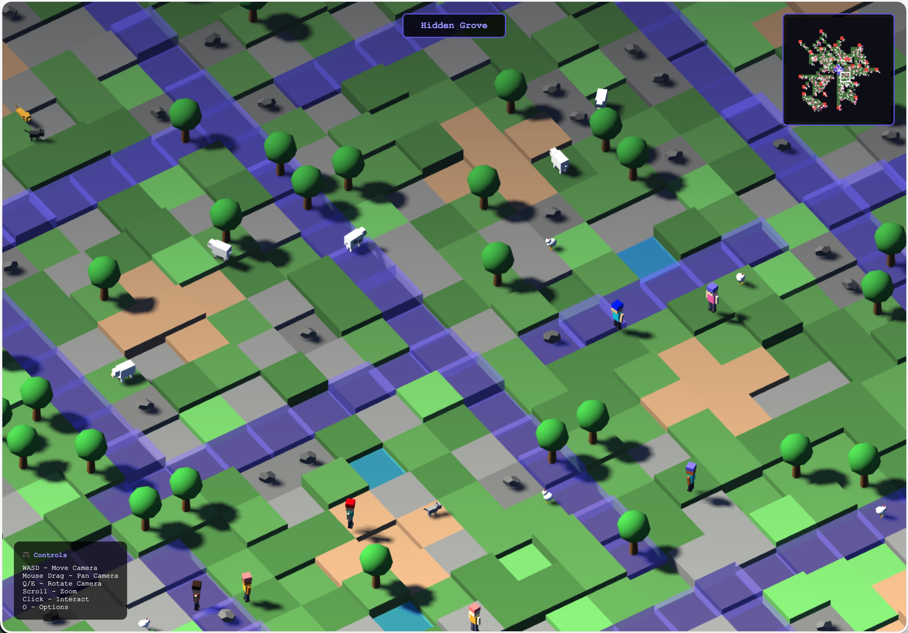

# AI World



**[Play Now](https://christhomas.github.io/ai.world)**

A procedurally generated low-poly isometric world that runs in the browser. Every world is derived from a single seed: roads grow outward from a central hub as an organic tree, towns grow their own local road webs, walkable land only exists near those roads, and the rest is open sea. Six biomes radiate from the hub, each with its own ground palette, cliffs, foliage, animals and building style. Rivers carve terraces into waterfalls, villages have squares with a well, market stalls, a church and shops, and you walk it all as a small hero who can talk to everyone.

## Controls

| Key/Action | Description |
|------------|-------------|
| **W A S D / Arrows** | Walk |
| **Enter / Space** | Talk to the nearest creature or villager (click also works) |
| **Up / Down, Enter** | Move through and pick dialogue choices |
| **Q / E** | Rotate camera |
| **Scroll Wheel** | Zoom in/out |
| **M** | Toggle minimap between local zoom and whole world |
| **F** | Free camera (WASD / drag pans the camera instead of walking) |
| **N** | New world (new seed) |
| **O** | Options panel |
| **X** | Swing (two damage with the iron sword, one bare-handed) |
| **I** | Rucksack: wear gear, stow it, eat food |
| **J** | Journal: errands, what you carry, places found, ferry times, map key |
| **1 / 2 / 3** | Pick a save slot on the title screen |
| **Escape** | Close dialogue/options |

URL parameters (skip the title screen, play in a scratch slot): `?seed=123` loads a specific world, `&x=100&z=-50` starts the hero at a world position, `&t=0.9` sets the time of day, `&cam=free` starts in free-camera mode.

## What's in the world

- **Six biomes** in warped sectors around the hub: meadows, woods, dunes, marsh, highlands, snow. Each has its own palette, terrace roughness, foliage table (oaks, pines, cacti, palms, reeds, flowers, mushrooms, lilies…) and house style.
- **Rivers and lakes.** Rivers start beside highland roads, follow the corridor downstream, and only ever step down, so every terrace they cross is a waterfall. Roads cross them on bridges. Rivers that run out of land end in lakes.
- **Animals in groups.** Cows, sheep, horses and chickens in the meadows; deer, rabbits, foxes and bears in the woods; camels, lizards and vultures in the dunes; frogs, ducks and herons in the marsh; goats, eagles and wolves in the highlands; hares, wolves and elk in the snow. Prey flee from you, fliers circle, ducks stay on water.
- **Towns and villages.** Nine towns act as secondary hubs with their own road webs; smaller villages sit on wide branches. Every settlement has a square with a well and market stalls, a church with a congregation, houses with door paths, and two to four shops (general store, blacksmith, inn, apothecary) with a keeper at the door.
- **Talking and trading.** An RPG-style dialogue box with typewriter text and choices. Shopkeepers sell items for gold (you start with 50); gold and inventory persist with the save.
- **Points of interest.** Shrines, ruins, watchtowers, campsites and giant trees off the road. Walking up to one names it, flashes a discovery banner, and marks it on the minimap.
- **Hearts, wolves and bears.** You have ten hearts. Wolves and bears stalk and bite; a sword makes them keep their distance, a shield halves the damage, a helm adds two hearts. Knocked out, you wake in the nearest town a little poorer.
- **Items that do things.** Food and potions heal, a lantern lights the night around you, the region map lifts the minimap fog, a rope lets you climb two terraces at once, a night at the inn heals fully and skips to dawn.
- **Quests.** Every village elder has one errand: go and find a named point of interest in a given direction, or bring items the village's own shops do not sell. Gold on completion; a quest log sits under the inventory.
- **Day and night.** Eight real minutes per day. The sun orbits, the sky goes orange then deep blue, windows glow, owls replace birds.
- **Sound.** Everything is synthesised in Web Audio: footsteps, biome ambience (birds, frogs, wind, eagles), dialogue blips, shop chimes, discovery jingles. Volume in the options panel.
- **Three save slots** on the title screen. The minimap keeps fog of war until you have explored (or bought the map).
- **A rucksack and six slots.** Everything you buy, catch, loot or are given goes into the pack; wearing it is a separate decision. Head, body, hand, off hand, feet and pocket, one item each, and swapping always puts the old piece back in the pack. Worn gear is what counts: attack comes from what is in your hand, defence and extra hearts from armour, and tools only work while held, so a lantern in the pack lights nothing and the rope has to share the pocket with the map. You set out in a tunic and boots with a stick and some food.
- **Fighting.** Wolves and bears stalk you by day; after dark packs of them, and bats, come out. Cave rats, bats, slimes and skeletons live underground. Swing with X: an arc in front of you, damage from the weapon you hold, kills pay gold and sometimes a pelt, fang or gem. Armour turns bites aside, but never all of one.
- **Buying and selling.** Every shop buys as well as sells, at half price, and only what it deals in: the smith takes gear, the inn takes food and your catch, the apothecary takes cures, the general store takes anything. Weapons and armour come in tiers, from a stout stick to a war axe and from a wool tunic to chain mail.
- **Islands and ferries.** Four islands lie past the mainland's reach, each its own biome with a harbour town and its own little road web. Piers on both shores; a ferry runs on a fixed timetable. Stand at the dock and press Enter to board (or read the timetable if the boat is away); you step off when it ties up.
- **Dungeons under shrines.** Every shrine hides a way down: rooms, corridors, torch-lit walls, pools, chests, and monsters in every room but the one you arrive in. The corridors into the treasure room are locked; one chest holds the key. The big chest at the far end pays gold and gear. Chest and key state is remembered; the stairs bring you back up, and being knocked out drags you up minus some gold.
- **Caves and shipwrecks.** Cave mouths in the cliffs lead to cramped winding caves with no locked doors. Wrecks on the beaches can be searched once for salvage. Both are their own anchors in the seed tree, so both are stable and both can be extended later.
- **Seasons and weather.** A week per season, four to a year: spring green, summer gold, autumn rust, winter blended toward snow. Rain and snow fall where the season and biome say they should, deterministically per day. Fish rise in the rain.
- **Fishing, camps and fingerposts.** Buy a rod, stand by water, cast with Enter and strike when it bites; four fish, and the inn buys the catch. Campfires can be slept at. Fingerposts at junctions name the nearest towns with direction and distance.
- **Villagers keep hours.** At dusk they walk home and go inside; shops shut until dawn. Nights are dark but walkable, and a lantern helps.
- **A soundtrack.** A wandering arpeggio over a drone, mode and tempo by biome, slower and lower at night, different underground. Synthesised like everything else.

## Development

```sh
pnpm install
pnpm dev        # http://localhost:5173
pnpm test       # vitest: rng, noise, road graph, terrain, hydrology, structures, entities, shops, quests
pnpm build      # typecheck + production build into dist/
```

`src/world/golden.test.ts` pins a fingerprint of the generated world for two seeds. Refactors must keep it; a deliberate tuning change updates the constants (and changes every saved world's layout). See `docs/human-code-report-2026-09-03.md` for the readability pass.

Deployment is a GitHub Action (`.github/workflows/deploy.yml`) that builds `dist/` on every push to `main` and publishes it to GitHub Pages. The repository's Pages source must be set to **GitHub Actions**.

The original single-file prototype is kept at `legacy/index.html` for reference.

## How the world is built

**Seeded everything.** `src/core/rng.ts` provides a seeded PRNG and a coordinate hash. `Math.random` is only used to pick a brand-new seed. A seed reproduces the whole world, so nothing about the terrain is stored; only the session (seed, camera) is persisted in IndexedDB through the `SaveStore` interface in `src/save/store.ts`.

**Road graph** (`src/world/graph.ts`). A space-colonisation tree grown in continuous 2D: attractor points are scattered over a disc and thinned by noise so some regions stay empty; each attractor pulls its nearest road node, nodes grow toward the pull, and attractors die once reached. Nearby nodes on different branches are joined into loops. Subtree size sets the road's width and the width of land around it.

**Terrain** (`src/world/terrain.ts`). For every tile the sampler finds the nearest road segment. Distance to the road decides sea vs. land, road vs. ground, and how many terraces rise away from the road (scaled by the biome's roughness). Biomes are noise-warped angular sectors around the hub; the hub itself is always plains.

**Mesh** (`src/world/mesher.ts`). Each 16×16 chunk becomes one flat-shaded, vertex-coloured mesh: a top quad per tile and cliff walls wherever a neighbour is lower. Road tiles carry per-corner heights so slopes are true ramps. No textures anywhere. Props (trees, rocks, cacti…) are primitive-built geometries drawn with `InstancedMesh`, one draw call per kind per chunk.

**Hydrology and structures** (`src/world/rivers.ts`, `src/world/structures.ts`). Both are generated once from the road graph inside the terrain sampler, so every worker and the main thread agree. Structures are stamped onto chunks after raw sampling: yards flattened, door paths laid, the building placed as an instanced prop with a fixed rotation.

**Combat and hours** (`src/game/combat.ts`, `src/entities/entity.ts`). A swing tests an arc in front of the hero; hits stagger, flash and knock back; kills pay out and despawn. Creatures with `hp` can be fought, creatures with `dangerous` bite back, and `hunt` behaviour chases. Villagers carry a home door and an awake window, so dusk empties the streets.

**Seasons, weather and sound** (`src/game/seasons.ts`, `src/render/weather.ts`, `src/game/music.ts`). Seasons tint terrain and props through one shared shader patch, weather is a camera-following Points cloud, and both the effects and the soundtrack are Web Audio synthesis with no asset files.

**Creatures** (`src/entities/`). Every animal and character is a handful of primitive parts. Each (kind, part) pair is one `InstancedMesh`; animation rewrites instance matrices, so forty sheep cost the same draw calls as one. Herds spawn per chunk from the seed and despawn when you leave. The hero is just another entity driven by the keyboard.

**Seed tree** (`src/world/manifest.ts`). The root seed makes the mainland; every expansion (an island, a dungeon) is an *anchor* with its own seed attached at a location. Seeds derive from the parent by default so the tree is reproducible from the root, but the manifest is saved with the slot: an anchor can be overridden by hand, keeps its generator version, and new kinds can be appended later without disturbing what is already there. Islands (`graph.ts: planIslands/attachIslands`) grow their own road trees and are merged into the mainland graph; dungeons (`src/dungeon/`) are generated on entry from their anchor seed. Ferries (`src/game/ferry.ts`) are a pure function of world time, so nothing about them is saved.

**Game state** (`src/game/`). `GameState` holds hearts, gold, the rucksack, what is worn in each slot, time of day, explored cells, quest progress and discoveries, and serialises into the save slot. Attack, defence, maximum hearts and abilities are all derived from worn gear, so there is one source of truth. `items.ts` is the item table with slots and stats, `shops.ts` the stock and buy filters, `quests.ts` builds one errand per village from the seed, `talk.ts` turns an entity into a dialogue tree, `audio.ts` is the synthesiser. `core/salts.ts` names every random stream so none of them collide.

**Streaming** (`src/world/chunkManager.ts`). Chunks within a radius of the camera are generated in a Web Worker pool (`src/workers/chunkgen.worker.ts`) and uploaded as ready; chunks far from the camera are disposed. Chunks with no land are skipped before any mesh work, so cost tracks the walkable area rather than the map's bounding box.

### Layout

```
src/
  core/        config, seeded rng, game loop, input
  world/       noise, biomes, road graph + islands, seed manifest, rivers, structures, terrain sampler, mesher, chunk manager
  dungeon/     room/corridor generator, dungeon walkability + chunks, dungeon scene
  workers/     chunk generation worker
  render/      scene rig (lights, shadows), day/night cycle, water material, isometric camera, prop + building geometry
  entities/    animal/character rigs, instanced renderer, behaviours, spawning, player
  game/        game state + equipment, items, shops, quests, combat, fishing, ferries, seasons, dialogue, audio
  ui/          hud, rucksack, journal, dialogue box, title/slots, minimap, styles
  save/        persistence interface + IndexedDB implementation
  main.ts      bootstrap
```

### Tunables

`src/core/config.ts` holds the knobs: chunk size, terrace step, water level, view radius, road-graph density (`ATTRACTOR_SPACING`, `INFLUENCE`, `KILL`, `STEP`), world radius, town count and spacing, river and lake counts, and camera speeds. Biome palettes and prop tables live in `src/world/biomes.ts`; animal rigs and spawn tables in `src/entities/animals.ts`; shop stock in `src/game/shops.ts`.

## Roadmap

1. ~~Foundation: modules, seeded generation, road graph, streaming, terraced mesh, ramps, water.~~
2. ~~Rivers, lakes, waterfalls, animated water, richer foliage.~~
3. ~~Animals in herds, player avatar with follow camera.~~
4. ~~Towns, villages, churches, shops, dialogue, points of interest, discovery.~~
5. ~~Biome blending, hearts and predators, item effects, quests, day/night, sound, save slots.~~
6. ~~Seed manifest, islands with harbour towns, ferries on a timetable, dungeons under shrines.~~
7. ~~Monsters, combat, keys and locked doors; seasons, weather and a soundtrack; fishing, camps, fingerposts and a journal; villager hours; caves and shipwrecks.~~
8. ~~Rucksack with equipment slots, gear tiers, buying and selling at every shop.~~
9. Ideas: free sailing rather than fixed ferries, deeper dungeon floors, boss rooms, gear the hero visibly wears.

## Technology

- **Three.js** — rendering (orthographic isometric camera, PCF shadows, vertex-coloured Lambert materials)
- **TypeScript + Vite** — modules, workers, build
- **Vitest** — unit tests for the pure generation code
- **idb-keyval** — IndexedDB session persistence

## License

MIT
