# AI World

A whole world from a single number. Roads grow outward from a crossroads, towns put down their own
webs of lanes, rivers fall over the terraces they cross, and the sea takes everything the roads
never reached. You walk it as one small hero: talk to people, take errands, buy a horse, sow a
field, sail to an island, and go down under a shrine to see what is keeping the treasure.

**[Play it here](https://christhomas.github.io/ai.world)**

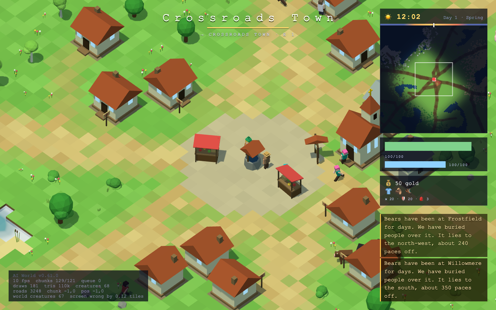

Everything you can see is built from flat-shaded polygons and vertex colours. There are no
textures anywhere, no image files, and no sound files: the music and every noise in the world are
synthesised as you play.

---

## Getting around

| Key | What it does |
|---|---|
| **W A S D** or arrows | Walk. Under sail, W and S row while A and D swing the bow |
| **Enter** or **Space** | The one key that does things: talk, open a door, read a board, board a boat, mount a horse, sow, harvest, open a chest, take the stairs |
| **X** | Swing whatever is in your hand |
| **I** | Rucksack: wear gear, stow it, eat food |
| **J** | Journal: errands, what you carry, places found, ferry times |
| **M** | The map, full screen. Drag or WASD to pan, scroll or +/- to zoom, C to centre on you |
| **T** / **G** | Chat, and deal with the nearest traveller: goods, or a friendly bout |
| **K** / **L** / **R** | Your party, who else is in this world, and a rally point where you stand |
| **Q / E**, scroll | Turn the camera, zoom |
| **F** | Free camera |
| **P** | Photo mode: the interface steps aside, Space takes the picture |
| **N** | Save and return to the title, which puts the whole world away rather than leaving it running |
| **O** | Options: light, graphics, volume, multiplayer, seed |

Three save slots on the title screen. `?seed=123` opens a particular world, and `&x=100&z=-50`
starts you somewhere in it.

---

## What is out there

### Towns you can walk into

Every settlement has a square with a well, market stalls, a notice board and a chapel. **Every
door opens.** Step through and the view cuts to a fixed top-down room, furnished for whoever lives
there: a bed and a hearth in a cottage, shelves and a counter in the store, a forge and an anvil at
the smith, pews down a red aisle in the chapel.

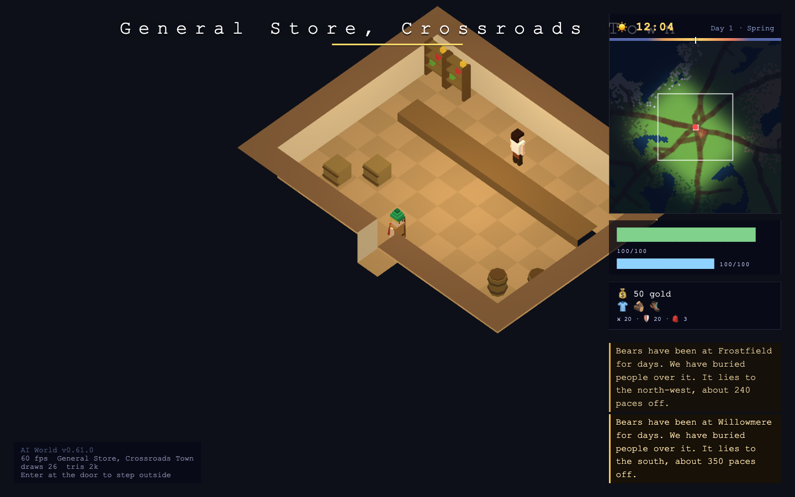

Shopkeepers stand behind their counters and buy as well as sell, at half price, each dealing only
in their own line. Villagers keep a day: out to the fields at dawn, the square at noon, the inn in
the evening, home to bed at night, when the shops shut and the windows light up.

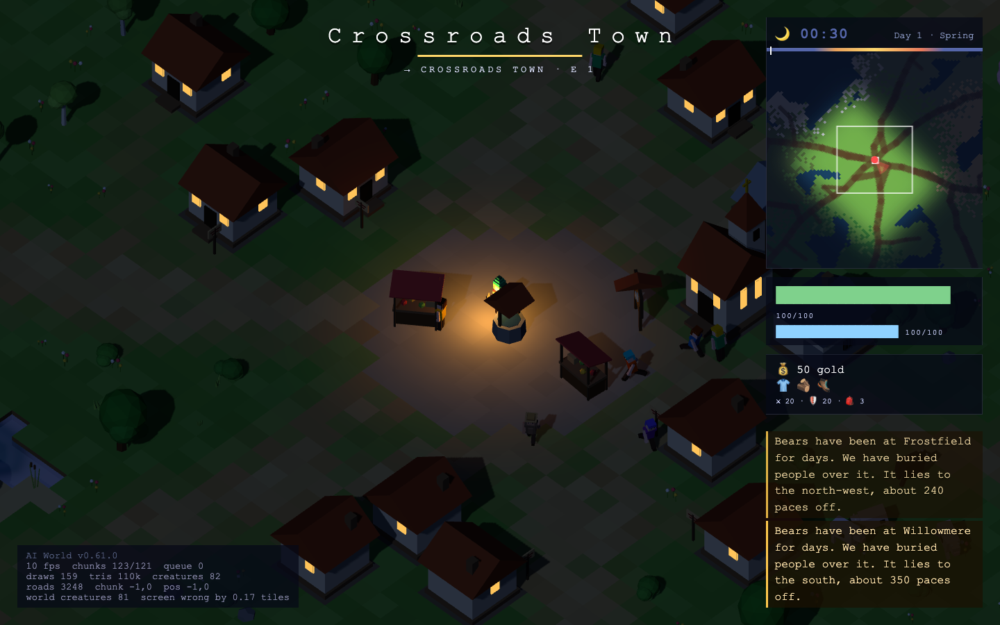

### A rucksack, and gear you can see

Everything you buy, catch, loot or are given goes into the pack. Wearing it is a separate
decision: six slots, one item each, and swapping always puts the old piece back. Attack comes from
what is in your hand, armour turns bites aside, and tools only work while held, so a lantern in
the pack lights nothing and the rope must share a pocket with the map.

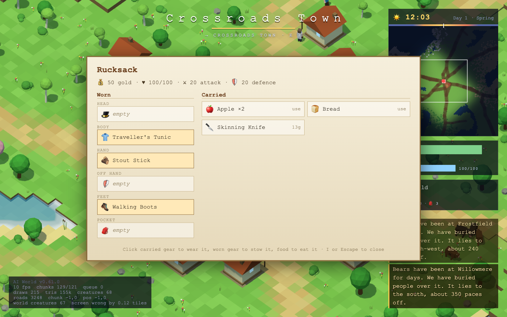

Whatever you wear, you wear visibly.

### A wood, not one tree stamped four hundred times

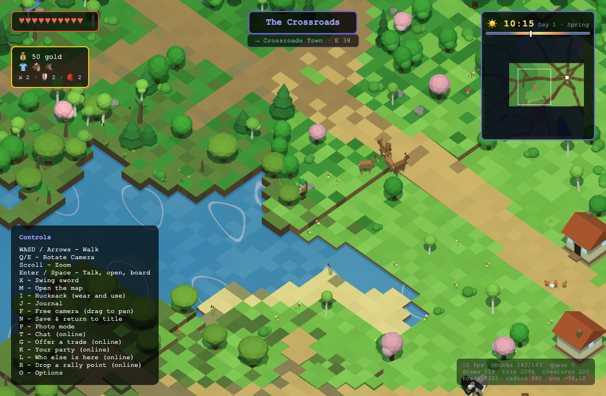

Eighteen kinds of scenery grow according to the biome underfoot — oak, birch, pine, fir, willow,
palm, cactus, blossom and the rest — and no two of anything are quite alike. Every prop is rolled
from its own tile's hash for height against width, a slight lean off upright, and how light or
dark it stands against its neighbour. It costs nothing to draw: one shape, one material, and a
matrix per placement.

### Seasons, weather and a calendar that matters

A week to a season, four to a year. Autumn turns the meadows to rust; winter blends the whole
world toward snow. Rain and snow fall where the season and the biome say they should, and fish
rise in the wet.

| Autumn | Winter |
|---|---|
| 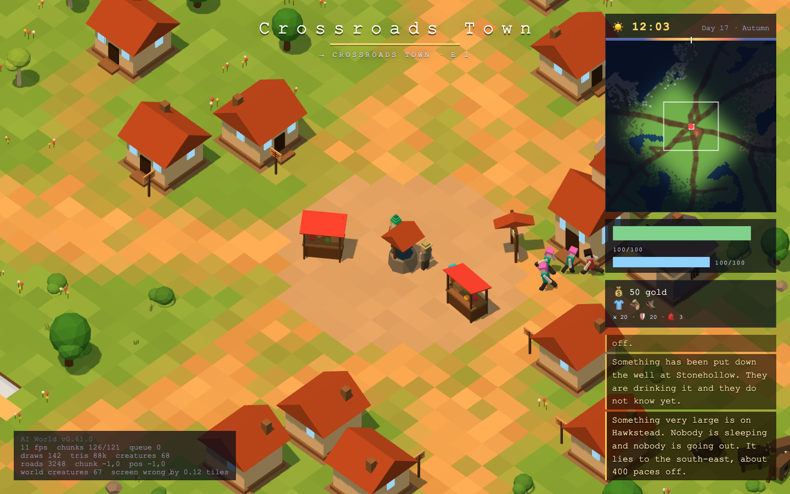 | 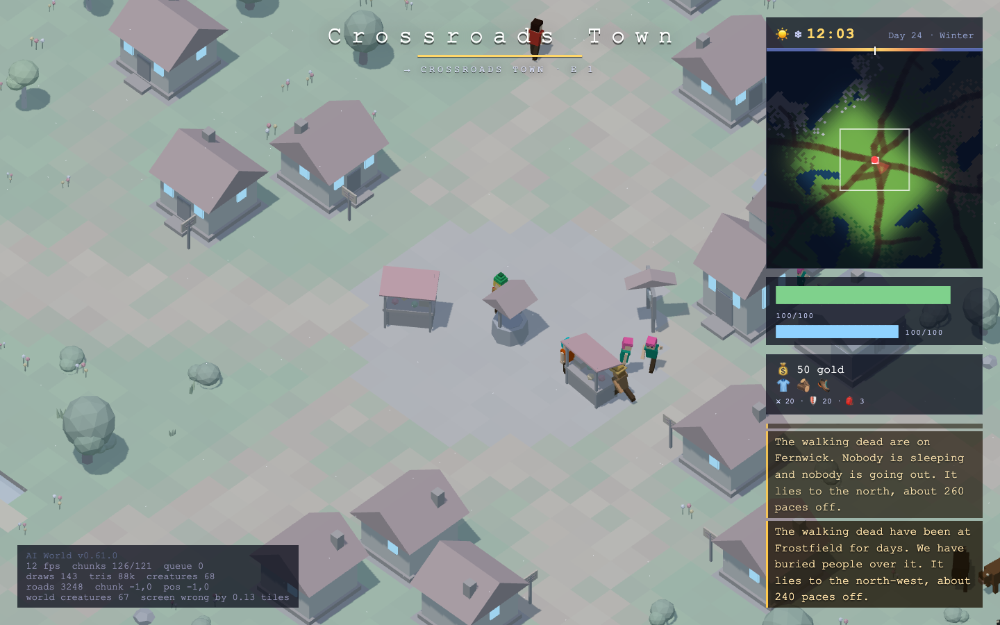 |

Buy seeds, break ground beside a village, and come back in a few days for the harvest.

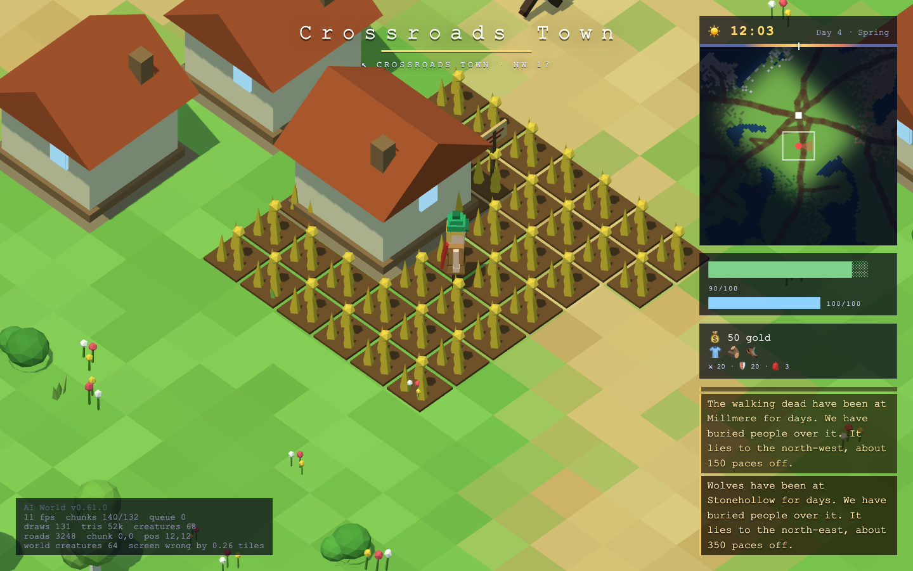

### Roads, horses and the sea

The map is 480 tiles across, so a stablehand in any village square will sell you a horse. Press
Enter beside it to ride, Enter again to tie it up.

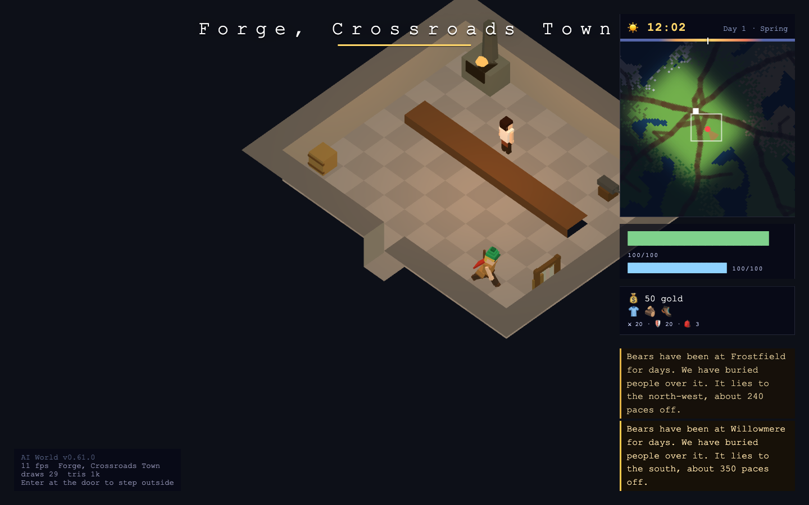

Four islands lie past the mainland's reach, each with its own biome, harbour town and road web. A
ferry runs between them on a fixed timetable, or a boatwright at any pier will sell you a boat of
your own and let you go wherever you like.

| An island town | Under sail |
|---|---|
| 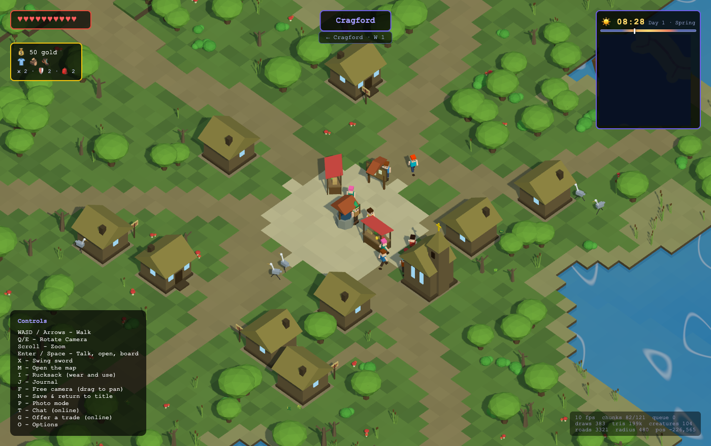 | 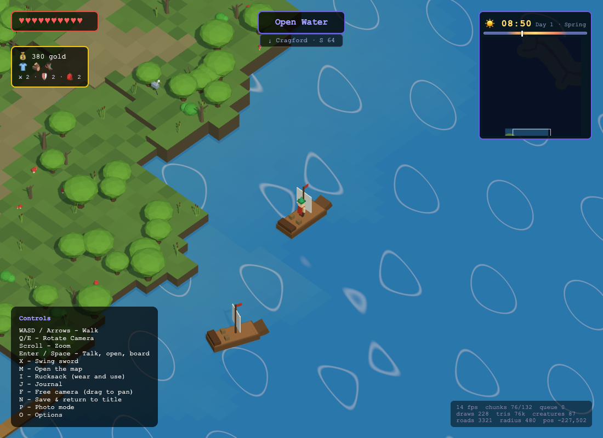 |

### Under the shrines

Every shrine hides a way down: torch-lit rooms, corridors, pools, locked doors and the key to
them, and monsters in every room but the one you arrive in. Vaults go three floors deep, each
busier than the last, and something large is waiting at the bottom.

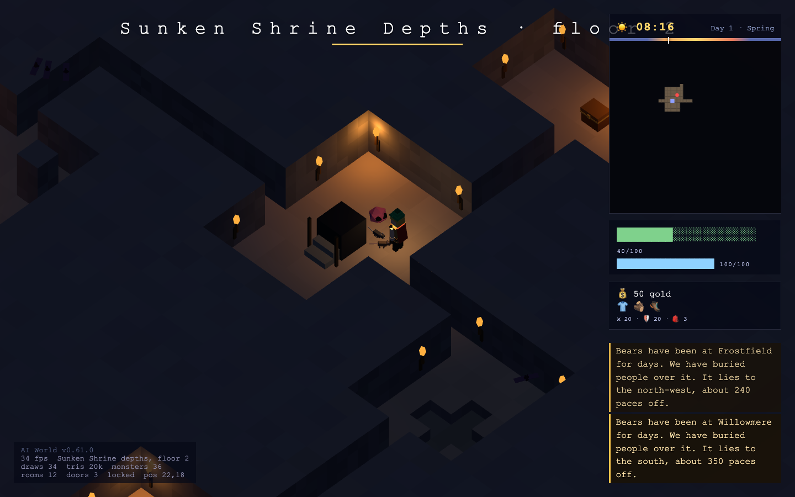

Cave mouths in the cliffs open into rougher, single-floor caves. Wrecks on the beaches can be
searched once for salvage.

### The map

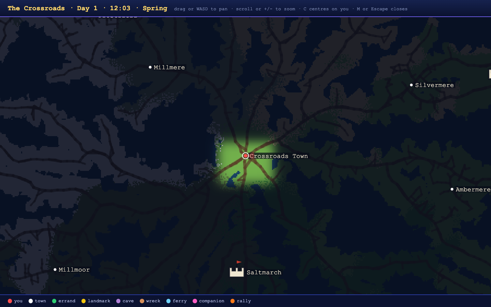

Towns are always named. Landmarks, caves and wrecks are named once you have found them, ferries
show live, and your errand is ringed in green. The fog lifts as you walk, or all at once if you
buy the region map.

### Playing together

`pnpm server` runs a small WebSocket server. Put its address in the options, pick a name, and
anyone on the same seed shares your world: you see each other walk, wearing your own gear, with
name plates over your heads. **T** chats, **G** offers the nearest traveller gold or an item from
your pack, and they accept or decline.

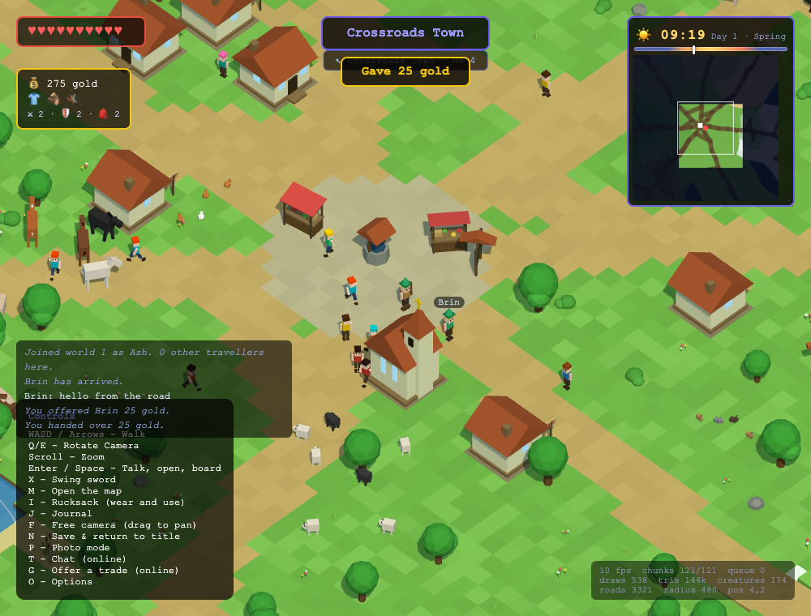

Everyone in a world keeps the same clock, so dawn breaks for all of you at once, and the few
things players change about the world are shared: a chest opened stays opened, a vault unlocked
stays unlocked, a crop sown grows in everyone's field, and a place one of you names appears on
everyone's map.

**Underground together.** Two people on the same dungeon floor grew the same rooms from the same
anchor seed, so only the monsters need agreeing. The lowest player id on a floor runs them and
describes them ten times a second; everyone else mirrors that and reports their blows for the
owner to resolve, which is what stops the same rat dying twice. A blow you struck in the last few
seconds makes that monster's fall yours, spoils and all.

### A market run by players

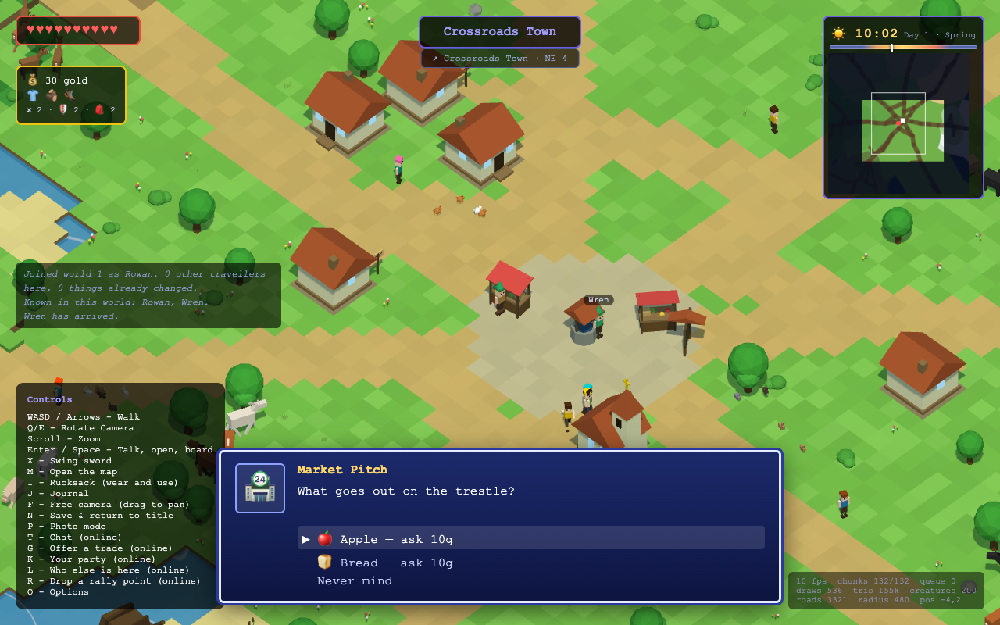

Every village square lays out its stalls. Twenty gold rents a pitch for three days, and you put
goods out at your own asking price. A pitch belongs to a name rather than a connection, so the
goods stay out while you sleep, somebody can buy an apple from a trader who is not online, and
the takings wait on the stall until you come back for them.

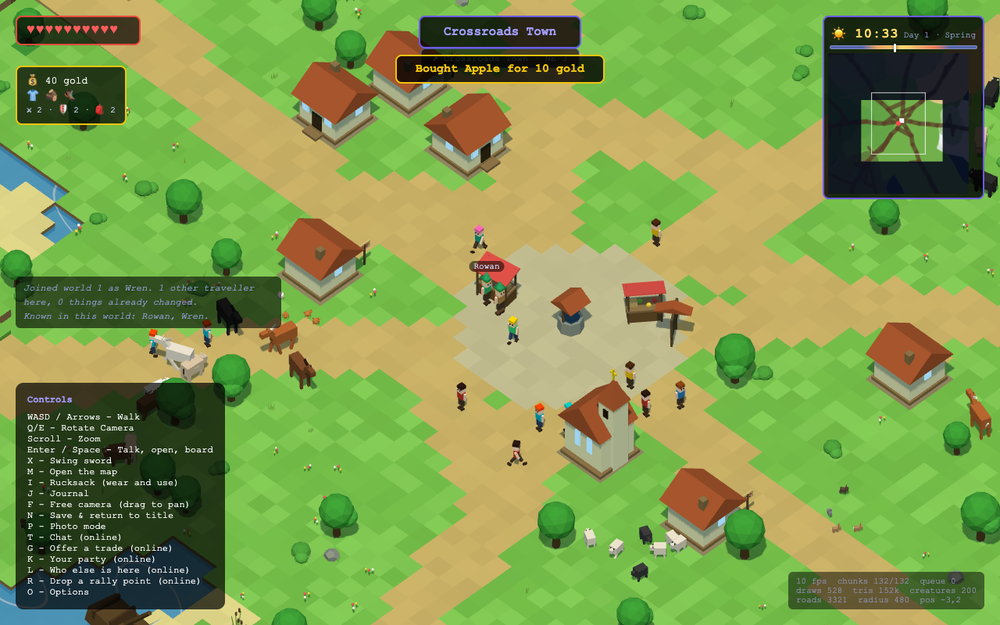

Inns keep a post shelf for the same reason. Hand the innkeeper something with a little gold for
the carriage, address it to anyone the world has met, and any inn in the land hands it over
whenever they next walk in.

### Companions, gestures and bouts

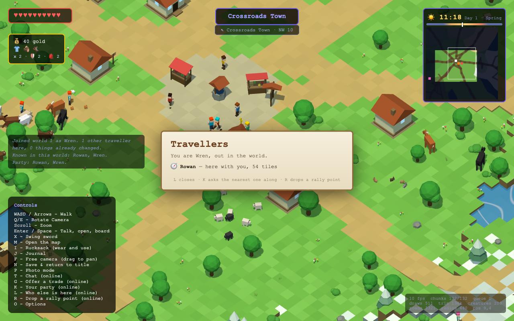

**K** asks the nearest traveller to come along. Companions are drawn on both maps at any
distance, and an errand one of you finishes counts for everyone who had taken it on: the reward
is paid to each of them where they stand. **L** lists everyone in the world, nearest first, and
**R** drops a rally point that stands on your companions' maps for a minute and a half.

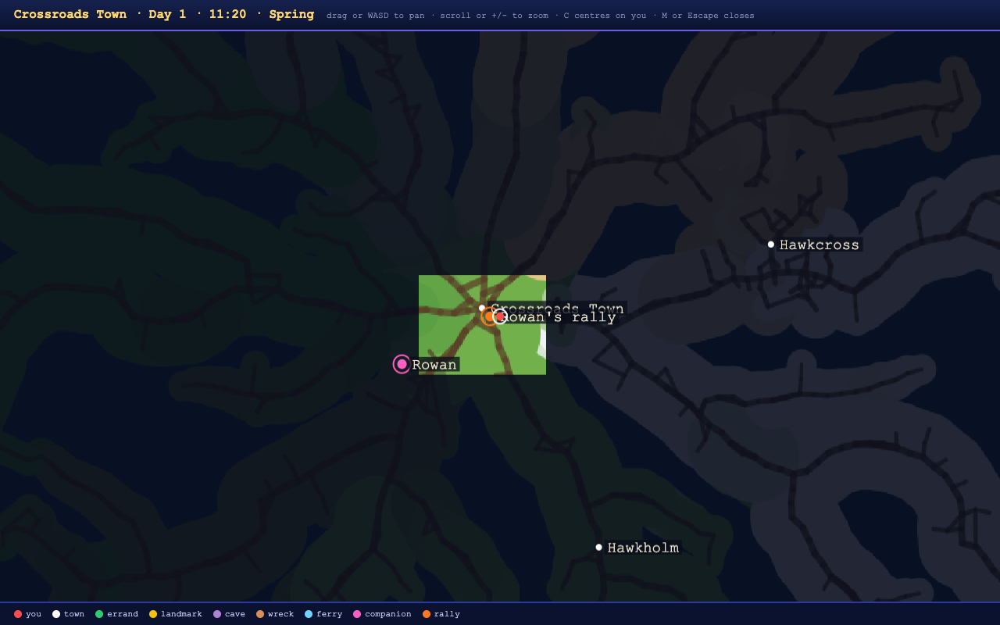

A line typed as `/wave`, `/bow`, `/cheer`, `/laugh`, `/thanks` or `/help` is a gesture rather than
words, and floats over your head for a few seconds.

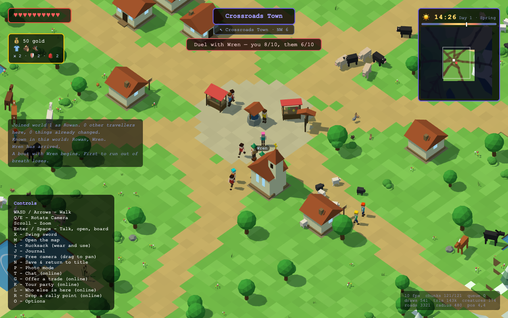

**G** also offers a friendly bout. Both sides must agree, and nothing real is at stake: the duel
runs on its own pool of health, so the loser walks away with the same hearts, gear and gold they
came with.

The server grows no terrain and knows no villages. Every client builds the same world from the
same seed, so what crosses the wire is only people, words, goods, the time of day, and the short
list of things players have changed. A name is how you are known, which means anyone can claim
any name: this is a game to play with people you know, not a hardened service.

---

## Running it yourself

```sh
chore dev          # the page on :5173 and the world server on :8787, together
chore web          # the page alone, or `chore web 3000` on another port
chore world        # the world server alone
chore check        # typecheck and the whole test suite
chore build        # typecheck and a production build into dist/
chore worlds       # what the server has kept: day, changes, stalls, parcels, who has visited
chore forget 1     # forget world 1's shared state; the world itself is still in the seed
chore ping         # ask a running server how it is
```

`chore` reads `chores.yml`; `chore --list` shows every task and `chore <task> --help` describes
one. One Ctrl-C stops both halves of `chore dev`, server included. The underlying scripts are
still plain pnpm (`pnpm dev`, `pnpm server`, `pnpm test`, `pnpm build`) if you would rather run
them directly.

The page fills in the server address itself: the one in `?server=`, else the one you used last,
else the machine that served the page. Playing with somebody on your network is
`chore web -- --host` away, with no address to type.

Deployment is a GitHub Action that builds `dist/` on every push to `main` and publishes it to
GitHub Pages; the repository's Pages source must be set to **GitHub Actions**. The original
single-file prototype is kept at `legacy/index.html`.

---

## How the world is built

**Seeded everything.** `Math.random` is used exactly once, to pick a new seed. Everything else
comes from a seeded generator or a coordinate hash, so a seed reproduces the whole world and
nothing about the terrain is ever stored. `src/world/golden.test.ts` pins a fingerprint of two
worlds so a refactor cannot quietly change them.

**A tree of seeds.** The root seed makes the mainland. Every expansion — an island, a dungeon, a
cave, a wreck — is an *anchor* with its own seed, derived from its parent and saved with the slot,
so any one of them can be overridden or versioned without disturbing the rest.

**Roads first, land second.** A space-colonisation tree grows roads outward from the hub, thinned
by noise so the map has empty bays. Land exists only near a road; its width comes from the size of
the branch. Terrain is then a distance field: how far you are from the road decides sea, beach,
road or hillside, and the biome sets how steeply the terraces climb.

**One mesh per chunk.** Each 16×16 chunk becomes a single flat-shaded, vertex-coloured mesh with
cliff walls wherever a neighbour is lower, built in a Web Worker pool and streamed around the
camera. Props, creatures and furniture are drawn as instanced meshes, so a forest or a herd costs
one draw call per kind.

**Rivers that only fall.** Rivers start beside highland roads and follow the road corridor
downhill, their level never rising, so every terrace they cross becomes a waterfall. Roads cross
them on bridges.

**The graphics chip, and what it is asked for.** The options panel names the chip actually
drawing the world, and says so plainly when a browser has quietly fallen back to software
rendering — that looks exactly like a slow computer from the inside, and it is worth knowing the
difference. Three quality levels change the two things that cost: the shadow pass, and how many
pixels a Retina display is asked for.

**Frames cost what they cost.** A frame is mostly the shadow pass: it was 46% of the draw calls
and 64% of the triangles until props smaller than half a cubic tile stopped casting — a flower's
shadow is not worth a draw call, a tree's is. The loop also declines frames a fast display offers
beyond `GAMEPLAY.MAX_FPS`, because drawing this world 120 times a second costs twice as much and
looks the same.

**A server that knows almost nothing.** Because every client grows the same world, the server
keeps one small JSON file per seed: the time of day, the short list of things players changed,
the market, the post shelf, and every name it has met. Everything else — who is where, what they
said, which monster moved — passes through and is gone.

### Layout

```
src/
  core/        config, seeded rng and salts, game loop, input
  world/       noise, biomes, road graph + islands, seed manifest, rivers,
               structures, terrain sampler, mesher, chunk manager
  workers/     chunk generation worker
  dungeon/     room and corridor generator, walkability, dungeon scene
  interior/    per-building room layouts, walkability, interior scene
  entities/    animal and character rigs, instanced renderer, behaviour, spawning, the player
  game/        state and equipment, items, shops, quests, combat, fishing, farming,
               ferries, sailing, mounts, seasons, dialogue, audio, and the shared-world
               systems: online client, co-op floors, market, parties, duels
  render/      scene rig, day cycle, weather, water, camera, geometry and props, hero gear
  ui/          hud, rucksack, journal, map, dialogue, chat, player list, title, styles
  save/        persistence interface and IndexedDB implementation
server/        wire protocol, the WebSocket server, and the world file it keeps per seed
chores.yml     how to run all of it: `chore dev`, `chore check`, `chore worlds`
```

### Tunables

`src/core/config.ts` holds the knobs: chunk size, terrace step, water level, view radius,
road-graph density, world radius, town count, river and lake counts, and camera speeds. Biome
palettes and prop tables live in `src/world/biomes.ts`, creature rigs and spawn tables in
`src/entities/animals.ts`, items in `src/game/items.ts`, shop stock in `src/game/shops.ts`.

Three readability passes are written up in `docs/human-code-report-2026-09-03.md`,
`docs/human-code-report-2026-09-03-pass2.md` and `docs/human-code-report-2026-09-04.md`.

## Built with

- **Three.js** for rendering: an orthographic isometric camera, PCF shadows, vertex-coloured
  Lambert materials and a little custom shader work for water and the seasons
- **TypeScript and Vite** for modules, workers and the build
- **Vitest** for the generators and the game systems
- **ws** for the multiplayer server
- **idb-keyval** for save slots

## License

MIT
